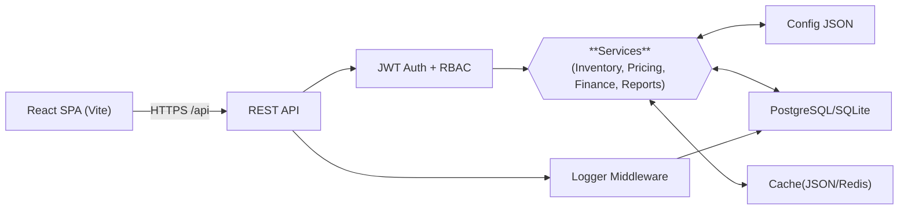

# Tradeflow Core

A lightweight tradeflow system designed for small businesses, built with React.js based frontend and Node.js + SQLite/PostgreSQL based backend.

## Key Features

- **Inventory Management**: Track inventory levels, inbound and outbound operations
- **Product Management**: Manage product information and pricing strategies
- **Financial Tracking**: Monitor accounts payable and accounts receivable
- **Sales Analysis**: Generate reports and analyze sales data
- **Multi-language Support**: Supports English, Korean, and Chinese
- **Data Export**: Supports data export in Excel format
- **JWT Authentication**: Stateless authentication system
- **Role Based Access Control**: Can assign **Editor** and **Viewer** to each user
- **Multi-Database Support**: Seamlessly switch between **SQLite** (default) and **PostgreSQL** for production environments

## Tech Stack

- **Frontend**: React 19, Vite, Ant Design, TypeScript
- **Backend**: Node.js, Express, SQLite3 / PostgreSQL, TypeScript
- **Authentication**: JWT stateless authentication
- **Styling**: CSS3, Ant Design component library
- **Logging**: Winston logging system
- **Precise Calculations**: Decimal.js for precise numerical calculations

## Backend Architecture Overview



## Demo

This is the detailed page for my demo link:
[My Demo](https://lihaozhe013.github.io/lihaozhe-website/posts/tradeflow-system/)


## Database Schema (Backend)

> SQLite doesn’t support **Date**, so we use TEXT instead…

### PARTNERS

| Column  Name | Data Type | Key    | Nullable | Default |
| ------------ | --------- | ------ | -------- | ------- |
| code         | TEXT      | Unique | No       | NULL    |
| short_name   | TEXT      | PK     | No       | NULL    |
| full_name    | TEXT      |        | No       | NULL    |
| type         | INTEGER   |        | No       | NULL    |

### PRODUCTS 

| Column  Name  | Data Type | Key    | Nullable | Default |
| ------------- | --------- | ------ | -------- | ------- |
| code          | TEXT      | Unique | No       | NULL    |
| category      | TEXT      |        | No       | NULL    |
| product_model | TEXT      |        | No       | NULL    |
| remark        | TEXT      |        | No       | NULL    |

### PRODUCT PRICE

| Column  Name   | Data Type | Key        | Nullable | Default           |
| -------------- | --------- | ---------- | -------- | ----------------- |
| id             | INTEGER   | UNIQUE, PK | No       | AI                |
| partner_code   | TEXT      | FK         | No       | NULL              |
| product_code   | TEXT      | FK         | No       | NULL              |
| effective_date | TEXT      |            | No       | CURRENT_TIMESTAMP |
| unit_price     | REAL      |            | No       | NULL              |

###  INBOUND RECORDS

| Column  Name   | Data Type | Key        | Nullable | Default           |
| -------------- | --------- | ---------- | -------- | ----------------- |
| id             | INTEGER   | UNIQUE, PK | No       | AI                |
| supplier_code  | TEXT      | FK         | No       | NULL              |
| product_code   | TEXT      | FK         | No       | NULL              |
| quantity       | INTEGER   |            | No       | 0                 |
| unit_price     | REAL      |            | No       | 0                 |
| total_price    | REAL      |            | No       | 0                 |
| inbound_date   | TEXT      |            | No       | CURRENT_TIMESTAMP |
| invoice_date   | TEXT      |            | Yes      | NULL              |
| invoice_number | TEXT      |            | Yes      | NULL              |
| receipt_number | TEXT      |            | Yes      | NULL              |
| order_number   | TEXT      |            | Yes      | NULL              |
| remark         | TEXT      |            | Yes      | NULL              |

### OUTBOUND RECORDS

| Column  Name   | Data Type | Key        | Nullable | Default           |
| -------------- | --------- | ---------- | -------- | ----------------- |
| id             | INTEGER   | UNIQUE, PK | No       | AI                |
| customer_code  | TEXT      | FK         | No       | NULL              |
| product_code   | TEXT      | FK         | No       | NULL              |
| quantity       | INTEGER   |            | No       | 0                 |
| unit_price     | REAL      |            | No       | 0                 |
| total_price    | REAL      |            | No       | 0                 |
| outbound_date  | TEXT      |            | No       | CURRENT_TIMESTAMP |
| invoice_date   | TEXT      |            | Yes      | NULL              |
| invoice_number | TEXT      |            | Yes      | NULL              |
| receipt_number | TEXT      |            | Yes      | NULL              |
| order_number   | TEXT      |            | Yes      | NULL              |
| remark         | TEXT      |            | Yes      | NULL              |

### RECEIVABLE PAYMENTS

| Column  Name  | Data Type | Key        | Nullable | Default           |
| ------------- | --------- | ---------- | -------- | ----------------- |
| id            | INTEGER   | UNIQUE, PK | No       | AI                |
| customer_code | TEXT      | FK         | No       | NULL              |
| amount        | REAL      |            | No       | 0                 |
| pay_date      | TEXT      |            | No       | CURRENT_TIMESTAMP |
| pay_method    | TEXT      |            | Yes      | NULL              |
| remark        | TEXT      |            | Yes      | NULL              |

### PAYABLE PAYMENTS

| Column  Name  | Data Type | Key        | Nullable | Default           |
| ------------- | --------- | ---------- | -------- | ----------------- |
| id            | INTEGER   | UNIQUE, PK | No       | AI                |
| supplier_code | TEXT      | FK         | No       | NULL              |
| amount        | REAL      |            | No       | 0                 |
| pay_date      | TEXT      |            | No       | CURRENT_TIMESTAMP |
| pay_method    | TEXT      |            | Yes      | NULL              |
| remark        | TEXT      |            | Yes      | NULL              |


## API Overview

- **Base URL**: `/api`
- **Auth**: `POST /api/login` returns a JWT; include `Authorization: Bearer <token>` in subsequent requests.

Key endpoints (high level):

| Area | Method & Path | Purpose |
| --- | --- | --- |
| Auth | `POST /api/login` | Exchange credentials for JWT |
| Overview | `GET /api/overview/stats` | Fetch dashboard metrics |
| Overview | `POST /api/overview/stats` | Trigger metrics recomputation |
| Products | `/api/products` (GET, POST, PUT, DELETE) | CRUD endpoints for product catalog |
| Partners | `/api/partners` (GET, POST, PUT, DELETE) | CRUD endpoints for customers/suppliers |
| Pricing | `/api/product-prices` (GET, POST, PUT, DELETE) | CRUD partner-specific product prices (also see `/current` and `/auto` helpers) |
| Inventory Inbound | `/api/inbound` (GET, POST, PUT, DELETE); `POST /api/inbound/batch` | Receive goods and perform batch updates |
| Inventory Outbound | `/api/outbound` (GET, POST, PUT, DELETE); `POST /api/outbound/batch` | Ship goods and perform batch updates |
| Stock | `GET /api/stock` | Real-time stock summary by product |
| Finance - Receivable | `/api/receivable/payments` (GET, POST, PUT, DELETE) | Track customer payments |
| Finance - Payable | `/api/payable/payments` (GET, POST, PUT, DELETE) | Track supplier payments |
| Export | `GET /api/export/:type` | Export configured datasets (e.g., Excel) |


## Quick Start

### Prerequisites

- Node.js 22+
- npm
- Docker (Optional)
### Development (Without Docker)

1.  **Clone the project**:

```bash
git clone [https://github.com/lihaozhe013/tradeflow-core.git](https://github.com/lihaozhe013/tradeflow-core.git)
cd tradeflow-core
```

2.  **Install dependencies**:

```bash
npm run install:all
```

3.  **Set up configuration**:

```bash
# Copy the example configuration files
mkdir -p data
cp -r config-example/* data/
```

4. **Init**:

```bash
npm run build
```

5.  **Start the development servers**:

```bash
# Start the dev server()
npm run dev
```

## Data Files
The system uses JSON configuration files located in the `data/` directory:

- `appConfig.json`: Application settings and company information
- `exportConfig.json`: Data export templates and settings