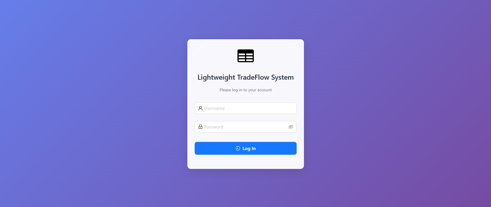
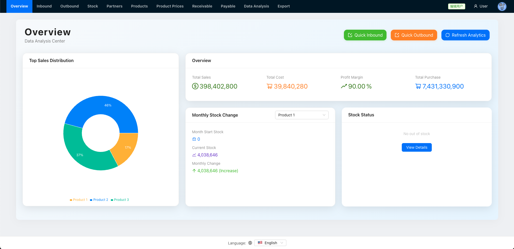
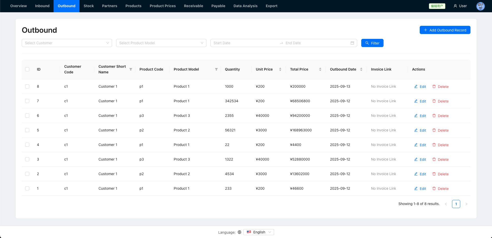
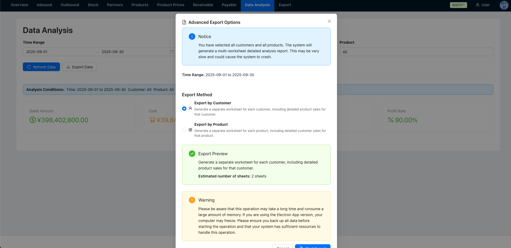
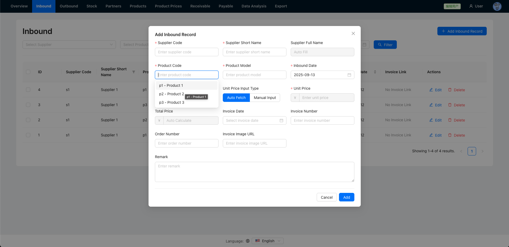

# MYF Tradeflow Core

A lightweight tradeflow system designed for small businesses, built with React, Node.js, and SQLite.

Originally developed for a relative’s family business (myf), it is now open‑sourced on GitHub.

The system was developed in a Chinese-language environment and extensively utilizes LLM for development support. Please note that English documentation is currently unavailable.

## Key Features

- **Inventory Management**: Track stock levels, inbound and outbound operations
- **Product Management**: Manage product information and pricing strategies
- **Financial Tracking**: Monitor accounts payable and accounts receivable
- **Sales Analysis**: Generate reports and analyze sales data
- **Multi-language Support**: Supports English, Korean, and Chinese
- **Data Export**: Supports data export in Excel format
- **JWT Authentication**: Stateless authentication system
- **Role Based Access Control**: Can assign **Editor** and **Viewer** to each user

## Tech Stack

- **Frontend**: React 19, Vite, Ant Design
- **Backend**: Node.js, Express, SQLite3
- **Authentication**: JWT stateless authentication
- **Styling**: CSS3, Ant Design component library
- **Logging**: Winston logging system
- **Precise Calculations**: Decimal.js for precise numerical calculations

## Demo

This is the detailed page for my demo link:
[My Demo](https://lihaozhe013.github.io/lihaozhe-website/posts/tradeflow-core/)











## ⚡ Quick Start

### Prerequisites

- Node.js 20+
- npm

### Installation

1.  **Clone the project**:

```bash
git clone [https://github.com/lihaozhe013/myf-tradeflow-core.git](https://github.com/lihaozhe013/myf-tradeflow-core.git)
cd myf-tradeflow-core
```

2.  **Install dependencies**:

```bash
npm run install:all
```

3.  **Set up configuration**:

```bash
# Copy the example configuration files
cp -r config-example/* data/
```

4. **Init**:

```bash
# Build (you should run this for the first time, this will copy appConfig.json to frontend folder)
npm run build
```

5.  **Start the development servers**:

```bash
# Start the dev server()
npm run dev
```

The application will be available at the following addresses:

- Frontend: http://localhost:5173
- Backend API: http://localhost:8080

## Production Deployment

For production deployment with PM2 cluster mode:

```bash
# One-click production deployment
cd ./scripts/production
./start-prod.sh
```

This will:

- Install PM2 globally (if not installed)
- Build the frontend application
- Start backend services with cluster mode (max instances)
- Configure logging and auto-restart

See [PM2 Deployment Guide](docs/pm2-deployment.md) for detailed instructions.

## Project Structure

```
myf-tradeflow-core/
├── backend/            # Node.js backend server
│   ├── routes/         # API routes
│   └── utils/          # Utility functions and middleware
├── frontend/           # React frontend application
│   ├── src/            # Source code
│   └── public/         # Static assets
├── scripts/            # Deployment and automation scripts
│   └── production/     # Production deployment scripts (PM2)
├── data/               # Database and configuration files
├── config-example/     # Example configuration files
└── docs/               # Project documentation
```

The system uses JSON configuration files located in the `data/` directory:

- `appConfig.json`: Application settings and company information
- `exportConfig.json`: Data export templates and settings
- `data.db`: SQLite database file
